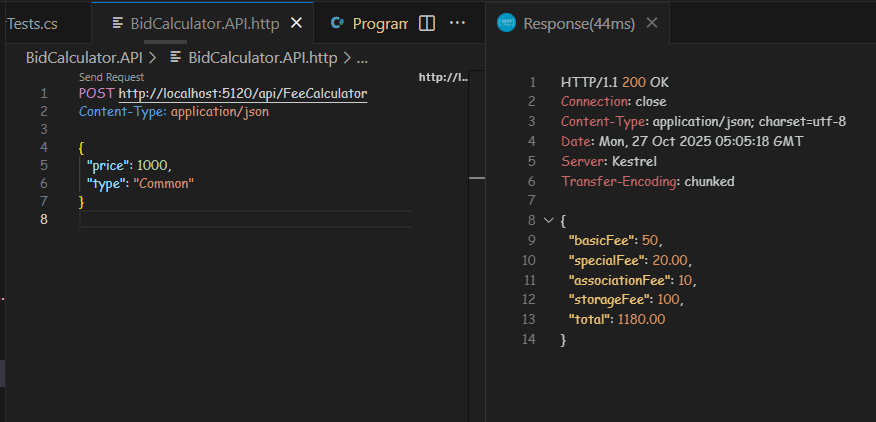

# 🚗 Bid Calculation Tool — Full Stack App

This is a full-stack web application that allows users to calculate the total cost of a vehicle at auction. It dynamically computes all applicable fees based on the vehicle's price and type (Common or Luxury), using a backend API and a responsive frontend interface.

---

## 🧱 Architecture Overview

The project is divided into two main components:

- **[Frontend](./frontend/README.md)**: Built with Vue 3 + TypeScript + Vite  
- **[Backend](./backend/README.md)**: Built with ASP.NET Core Web API

The backend handles fee calculations, while the frontend provides a user-friendly interface for input and result display.

---

## 📦 Tech Stack

| Layer     | Technologies Used                                      |
|-----------|--------------------------------------------------------|
| 🖥️ [Frontend](./frontend/README.md)    | Vue 3, TypeScript, Vite, Vitest, @vue/test-utils       |
| 🛠️ [Backend](./backend/README.md)   | ASP.NET Core Web API, C# 10, xUnit, Moq, FluentAssertions |

---

## 📊 Fee Calculation Logic

| Fee Type           | Common Vehicle                     | Luxury Vehicle                     |
|--------------------|-------------------------------------|-------------------------------------|
| Basic Buyer Fee    | 10% of price (min $10, max $50)     | 10% of price (min $25, max $200)    |
| Special Seller Fee | 2% of price                         | 4% of price                         |
| Association Fee    | Based on price range:               | Same as Common                      |
|                    | $1–$500 → $5                        |                                     |
|                    | $501–$1000 → $10                    |                                     |
|                    | $1001–$3000 → $15                   |                                     |
|                    | Over $3000 → $20                    |                                     |
| Storage Fee        | Fixed $100                          | Fixed $100                          |

---

## 🚀 Running the App Locally

### 🔧 Prerequisites

- [.NET SDK 7.0+](https://dotnet.microsoft.com/download)
- Node.js + npm
- Visual Studio or VS Code

## ▶️ [Backend](./backend/README.md)

```bash
cd backend/BidCalculator.API
dotnet run
```

API available at: http://localhost:5120/api/FeeCalculator

## ▶️ [Frontend](./frontend/README.md)

```bash
cd frontend
npm install
npm run dev
```

App available at: 
http://localhost:5173

🧪 Testing Backend
```bash
cd backend/BidCalculator.Tests
dotnet test
```

#### [Frontend](./frontend/README.md)
```bash
npx vitest run
```

Includes unit and integration tests. End-to-end tests are planned using Cypress or Playwright.

## 📁 Environment Setup

Create a `.env` file in the frontend root:

```env
VITE_API_URL=http://localhost:5120/api
VITE_STORAGE_FEE=100
```
These variables configure the backend endpoint and the default storage fee.  
Note: `VITE_STORAGE_FEE` is used to immediately display the storage fee in the UI before the backend response arrives. Since the fee is fixed and doesn't depend on vehicle data, it's safe to preload it from the environment. This improves perceived performance and ensures consistency even if the backend is slow or temporarily unavailable.


## 📸 Screenshots

### Initial View


### Run HTTP


## 📌 Production Considerations

If this were production-ready, I would:

    Secure backend endpoints with authentication and authorization

    Validate frontend inputs and backend requests robustly

    Add loading indicators and accessibility improvements

    Implement centralized error handling

    Add E2E tests

    Optimize performance with caching, lazy loading, and code splitting

    Apply security best practices (XSS prevention, input sanitization)

    Use environment-based configuration and secrets management

## 📂 Repository

GitHub:
https://github.com/GregHowe/bid-calculation-tool

