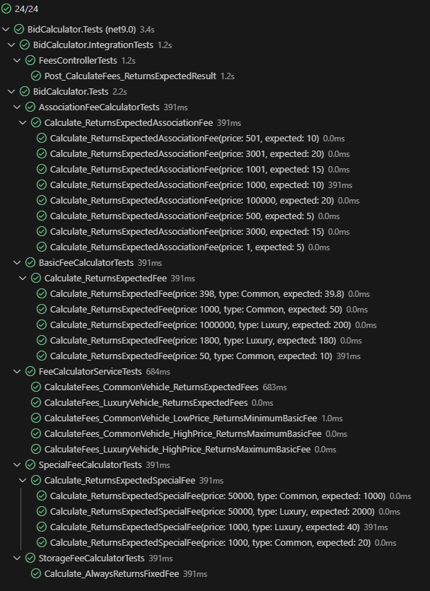

# 🧾 Bid Calculation Tool – Backend

This is the backend component of the **Bid Calculation Tool**, a full-stack web application designed to calculate the total cost of a vehicle at auction. It dynamically computes all applicable fees based on the vehicle's price and type (Common or Luxury).

---

## 🧱 Architecture Overview

The backend is built using **ASP.NET Core Web API**, following clean architecture principles and object-oriented design. Fee calculations are encapsulated in dedicated services for clarity, scalability, and testability. These services are injected via **dependency injection**, allowing loose coupling and easier testing.


### 🔧 Fee Calculators

- `BasicFeeCalculator`
- `SpecialFeeCalculator`
- `AssociationFeeCalculator`
- `StorageFeeCalculator`

These are injected into the main `FeeCalculatorService`, which orchestrates the full fee computation.

---

## 📊 Fee Calculation Logic

The total cost includes:

| Fee Type           | Common Vehicle                     | Luxury Vehicle                     |
|--------------------|-------------------------------------|-------------------------------------|
| Basic Buyer Fee    | 10% of price (min $10, max $50)     | 10% of price (min $25, max $200)    |
| Special Seller Fee | 2% of price                         | 4% of price                         |
| Association Fee    | Based on price range:               | Same as Common                      |
|                    | $1–$500 → $5                        |                                     |
|                    | $501–$1000 → $10                    |                                     |
|                    | $1001–$3000 → $15                   |                                     |
|                    | Over $3000 → $20                    |                                     |
| Storage Fee        | Fixed $100                          | Fixed $100                          |

---

## 🚀 Running the Backend

### 🔍 Prerequisites

- [.NET SDK 7.0+](https://dotnet.microsoft.com/download)
- Visual Studio or Visual Studio Code

## ▶️ Start the API

```bash
cd backend/BidCalculator.API
dotnet run
```

The API will be available at: 
http://localhost:5000/api/FeeCalculator

## 📬 API Endpoint

POST `/api/FeeCalculator`

Request:

```json
{
  "price": 1000,
  "type": "Common"
}
```

Response:
```json
{
  "basicFee": 50,
  "specialFee": 20,
  "associationFee": 10,
  "storageFee": 100,
  "total": 1180
}
```

🧪 Running Unit Tests
```bash
cd backend/BidCalculator.Tests
dotnet test
```

## Test Coverage

    ✅ FeeCalculatorService integration tests

    ✅ Individual fee calculators

    ✅ Edge cases (min/max fees, price thresholds)


## 📸 Screenshots

backend in action using .http files in Visual Studio Code.

| HTTP Request | JSON Response |
|--------------|---------------|
| `POST /api/fees/calculate`<br>Body:<br>`{ "price": 1000, "type": "Common" }` | `{ "basicFee": 50, "specialFee": 20, "associationFee": 10, "storageFee": 100, "total": 1180 }` |


Backend Unit and Integration Test Results — Full Pass




## 🛠 Technologies Used

    ASP.NET Core Web API

    C# 10

    xUnit

    Moq

    FluentAssertions


## 📁 Repository

GitHub: 
    https://github.com/GregHowe/bid-calculation-tool

## 📌 Production Considerations

As requested in the challenge PDF, here are notes on compromises and improvements:

    If this were production-ready, I would:

    Secure endpoints with authentication and authorization

    Validate incoming requests with data annotations or FluentValidation

    Use environment-based configuration and secrets management

    Optimize performance with caching and async patterns

    Add health checks and monitoring endpoints