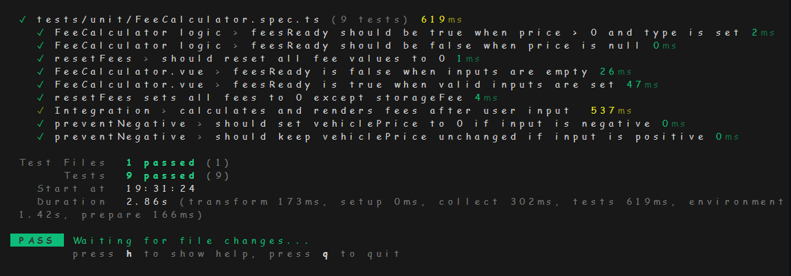

# 🚗 Bid Calculation Tool — Frontend

This is the **frontend** of the Bid Calculation Tool, a web application that allows buyers to calculate the total cost of a vehicle at auction, including dynamic fees based on price and vehicle type.

Built with **Vue 3 + TypeScript + Vite**, this UI communicates with a backend API to compute fees and display results in real time.

---

## 📦 Tech Stack

- Vue 3 with Composition API
- TypeScript
- Vite
- Vitest + @vue/test-utils
- Modular architecture with composables and environment config

---

## 🎯 Features

- Input fields for vehicle price and type (Common or Luxury)
- Dynamic fee calculation via backend API
- Real-time display of:
  - Basic buyer fee
  - Seller's special fee
  - Association fee
  - Fixed storage fee
  - Total cost
- Input validation with error messages
- Success message
- Responsive layout and centralized styling
- Environment variables for configuration

---

## 📁 Project Structure

```plaintext
src/
├── components/
│   ├── FeeCalculator.vue
│   └── FeeItem.vue
├── composables/
│   └── useFeeCalculator.ts
├── style.css
├── App.vue
└── main.ts
tests/
├── unit/
│   └── FeeCalculator.spec.ts
.env
```

---

## ⚙️ Environment Setup

Create a `.env` file in the root of the project:

```env
VITE_API_URL=http://localhost:5120/api
VITE_STORAGE_FEE=100
```
These variables configure the backend endpoint and the default storage fee.
Note: `VITE_STORAGE_FEE` is used to immediately display the storage fee in the UI before the backend response arrives. Since the fee is fixed and doesn't depend on vehicle data, it's safe to preload it from the environment. This improves perceived performance and ensures consistency even if the backend is slow or temporarily unavailable.

## 🚀 Getting Started
```bash
npm install
npm run dev
```

Then open https://localhost:5173/  in your browser.

## 🧪 Testing
Unit tests are written using Vitest and cover:

    Fee calculation logic

    Input validation

    Reset behavior

    Component rendering and integration

End-to-end tests are planned using Cypress or Playwright, but are not yet implemented.    

To run tests:
```bash
npx vitest run
```
Or watch mode:
```bash
npx vitest --watch
```

## 📸 Screenshots

 Place your screenshots in a `/screenshots` folder and update the filenames below.

### Initial View


### Common Vehicle — Successful Calculation


### Luxury Vehicle — Successful Calculation


### Validation Error — Missing Price


### Validation Error — Missing Vehicle Type


### UnitTest-IntegrationTest


## 🧠 Architecture Notes

This frontend follows clean code principles:

    KISS: Simple and readable logic

    DRY: Shared logic extracted to useFeeCalculator.ts

    SOLID: Separation of concerns between UI and business logic

    Environment config: No hardcoded URLs or constants

    Scoped components: Each UI element is modular and testable

    Composables: Business logic is extracted into reusable functions (e.g. useFeeCalculator), promoting separation of concerns and testability


## 📌 Production Considerations

As requested in the challenge PDF, here are notes on compromises and improvements:

    If this were production-ready, I would:

    Add loading indicators for better UX during API calls

    Improve accessibility (ARIA roles, keyboard navigation, screen reader support)

    Enhance responsive layout for mobile and tablet devices

    Handle API errors gracefully with user-friendly messages

    Implement centralized error handling using global interceptors or composables

    Add end-to-end tests using Cypress or Playwright

    Optimize performance with lazy loading and code splitting

    Apply security best practices (e.g. sanitize inputs, prevent XSS)